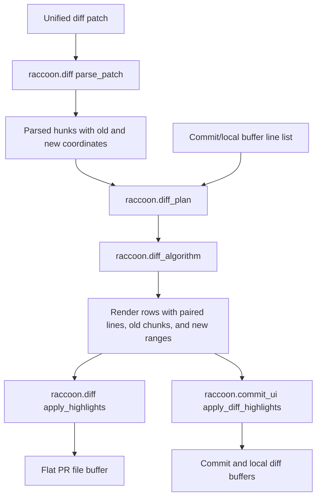

# Architecture Diff

## Summary
Exact inline diff rendering now uses one shared planner for flat PR diffs, commit viewer diffs, and local commit diffs.

## Diagram

## Changes

### Added
- `lua/raccoon/diff_algorithm.lua`: bounded sequence pairing and token/character inline range calculation.
- `lua/raccoon/diff_plan.lua`: shared render-plan construction for parsed hunks and commit/local line lists.
- `RaccoonAddInline` and `RaccoonDeleteInline` highlight groups.

### Modified
- `lua/raccoon/diff.lua`: parser now tracks old/new coordinates, and flat diff rendering consumes shared render rows.
- `lua/raccoon/commit_ui.lua`: commit and local diff buffers consume shared render rows instead of only line-level add/delete marks.
- `lua/raccoon/config.lua`: legacy inline diff config keys are dropped from loaded config.

### Removed
- Separate flat-vs-commit inline diff decisions at render call sites. Renderers now only paint rows produced by `diff_plan`.
