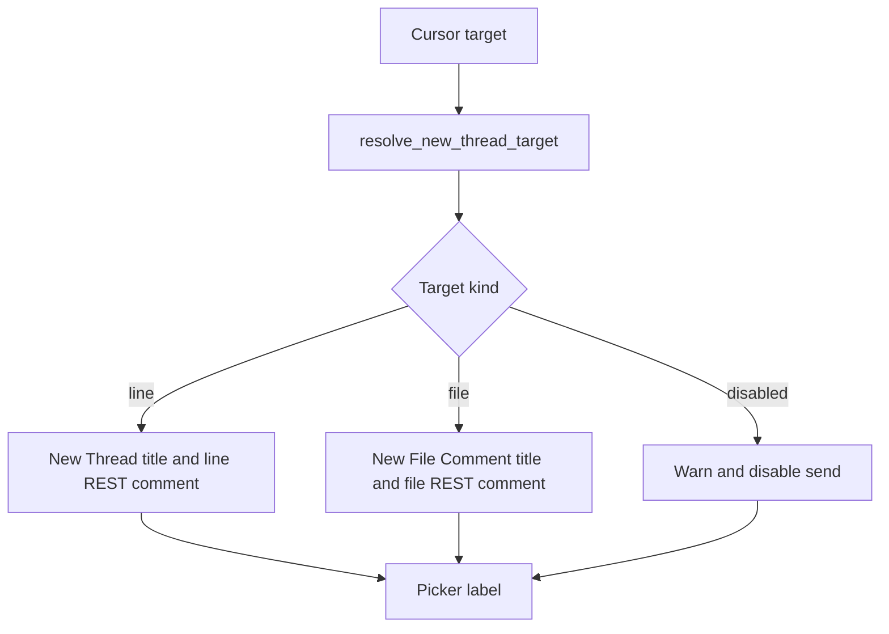
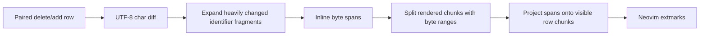

# Architecture Diff

## Summary
Split diff comments now use one target classification, and inline diff highlights are token-stable and projected onto wrapped rows.

## Diagram(s)

## Changes

### Added
- `comments.lua` now resolves new comment targets as `line`, `file`, or `disabled` before labeling, restoring, or sending.
- Split inline rendering now tracks byte ranges for each wrapped visual chunk.

### Modified
- Out-of-hunk changed-file targets remain allowed, but are consistently labeled and sent as file comments.
- Identifier replacements with noisy character matches are highlighted as whole changed tokens.
- Inline split highlights are projected onto continuation rows instead of disappearing when a changed line wraps.

### Removed
- Independent picker/editor/send decisions that could label a file comment as a line thread.
- The single-row-only guard that skipped inline highlights for wrapped split rows.
