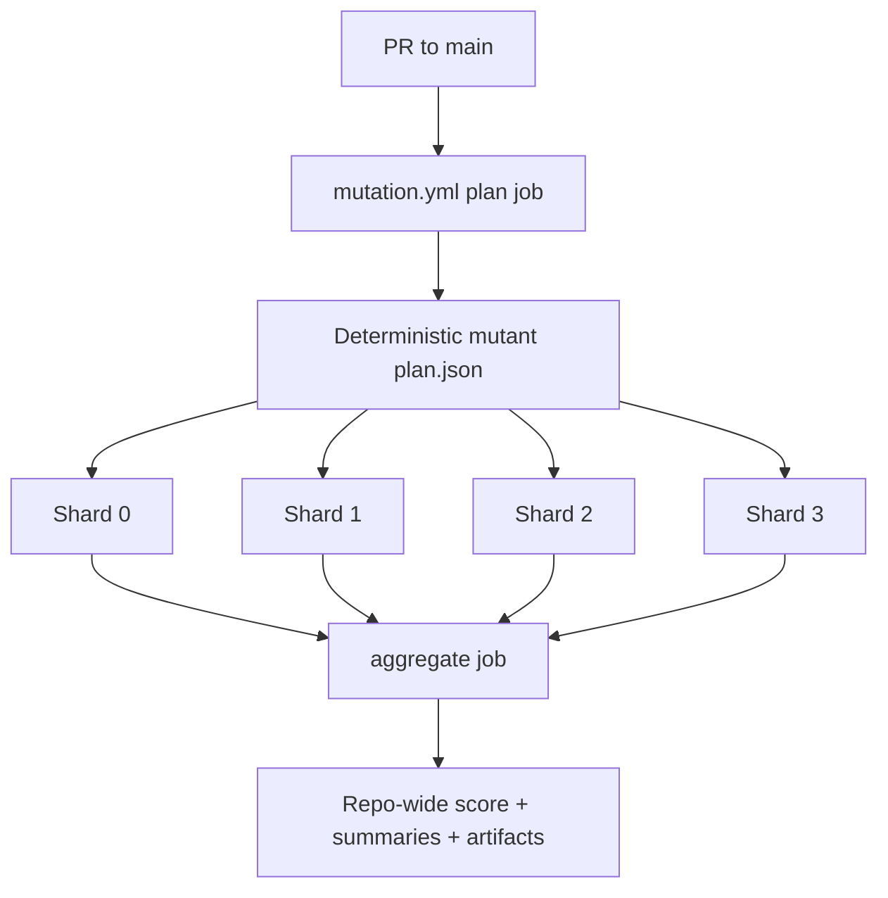

# Architecture Diff
## Summary
Add a repo-local mutation testing system with deterministic sampling, explicit module-to-spec mapping, sharded execution, and a dedicated GitHub Actions gate for PRs targeting `main`, starting with a blocking core-module scope and explicit deferred UI-heavy modules in policy.

## Diagram(s)

## Changes
### Added
- `scripts/mutation/`: Python mutation harness with plan, shard, and aggregate commands.
- `mutation/manifest.json`: Explicit module-to-spec mapping with reusable spec groups.
- `mutation/policy.json`: CI policy for threshold, timeout, sampling, shard defaults, and temporary excluded modules with rationale.
- `mutation/equivalents.json`: Reviewed equivalent-mutant allowlist.
- `.github/workflows/mutation.yml`: Dedicated PR-to-`main` mutation workflow with shard artifacts and aggregate summary.
- `tests/plugin_spec.lua`: Direct command-router coverage for `plugin/raccoon.lua`.
- Expanded direct coverage in `tests/init_spec.lua` and `tests/api_spec.lua`.

### Modified
- `Makefile`: Adds explicit Lua test, mutation unit-test, and mutation run entrypoints with mode banners.
- `tests/helpers/mocks.lua`: Extends curl mocking to `plenary.curl.request` for API wrapper coverage.

### Removed
- No production components removed.
