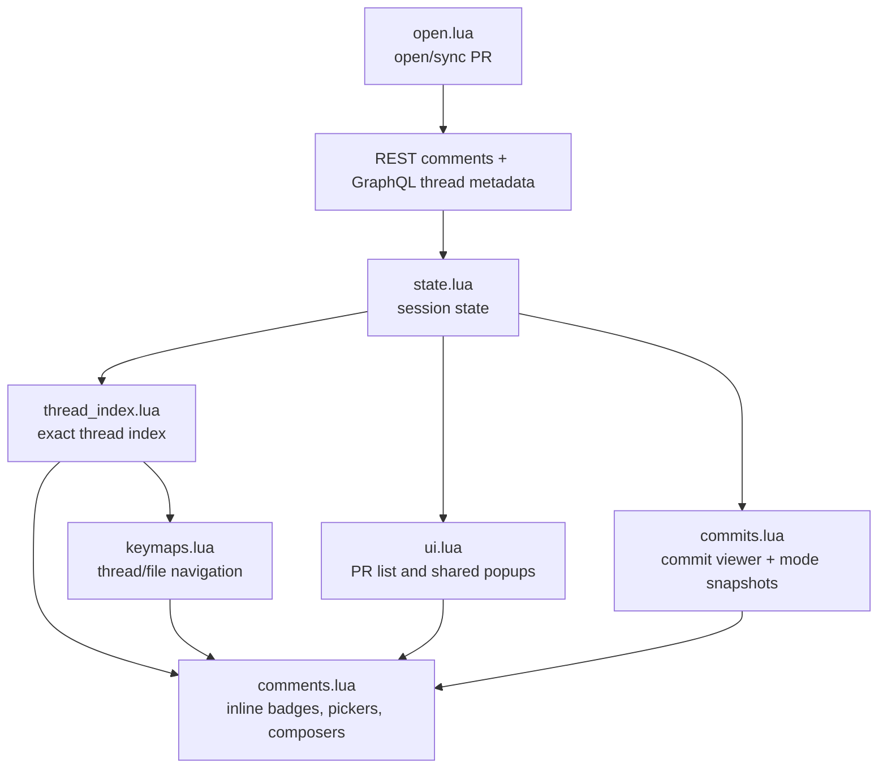
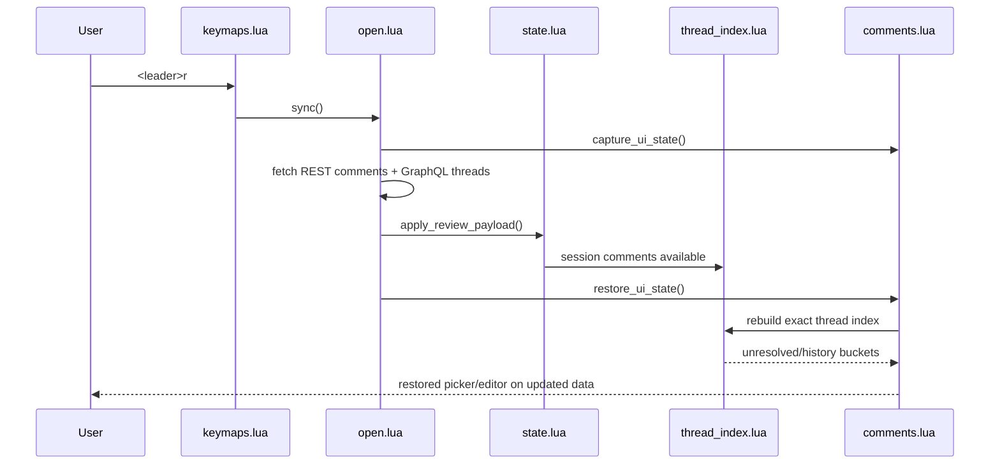

# Architecture Diff

## Summary

Flat diff review now treats GitHub review threads as exact `thread_id` entities, with unresolved-only inline rendering, exact-thread navigation, shared picker/editor restoration across full PR syncs, and bidirectional flat-diff/commit-viewer state restore for the current PR.

## Diagrams

## Changes

### Added

- `lua/raccoon/thread_index.lua`: single source of truth for exact-thread grouping, unresolved/history splits, `[NR/U/I]` counts, and same-line buckets.
- Viewer-login resolution in the PR open flow so needs-reply detection can work without guessing.
- `:Raccoon threads` and `:Raccoon files` plus matching flat-diff pickers.
- Sync-time UI snapshot and restore for pickers and composers.
- Commit-mode snapshot/restore so flat diff and commit viewer can hand control back and forth without losing draft text or navigation position.

### Modified

- `lua/raccoon/comments.lua`: inline rendering now uses the exact thread index, hides resolved review threads from flat diff markers, and sends real thread replies instead of line-grouped approximations. The same-line `comment` picker uses a history-aware line view so resolved same-line threads stay reachable, while new-thread creation is gated by real PR diff-context line detection.
- `lua/raccoon/commits.lua`: commit viewer now captures/restores flat-diff state on mode switches and remembers the last commit/page/file-tree position per PR.
- `lua/raccoon/keymaps.lua`: thread/file navigation now targets exact unresolved threads and flat-diff-only actions are enforced consistently in commit/local modes.
- `lua/raccoon/open.lua`: PR open/sync validates GraphQL thread metadata strictly when review comments exist, stores viewer login, and restores UI after sync.
- `lua/raccoon/ui.lua`: top-level pickers now share one UI family, use config-derived refresh/close hints, and respect hidden drafts preserved behind commit mode.
- `lua/raccoon/config.lua` and `lua/raccoon/config_compat.lua`: new shortcut defaults and optional token-level `login`.

### Removed

- Flat-diff reliance on line-grouped thread behavior.
- Resolved review-thread noise from flat diff and same-line thread picker flows.
- Local pending-comment workflow as an active review path; sending is now immediate.
