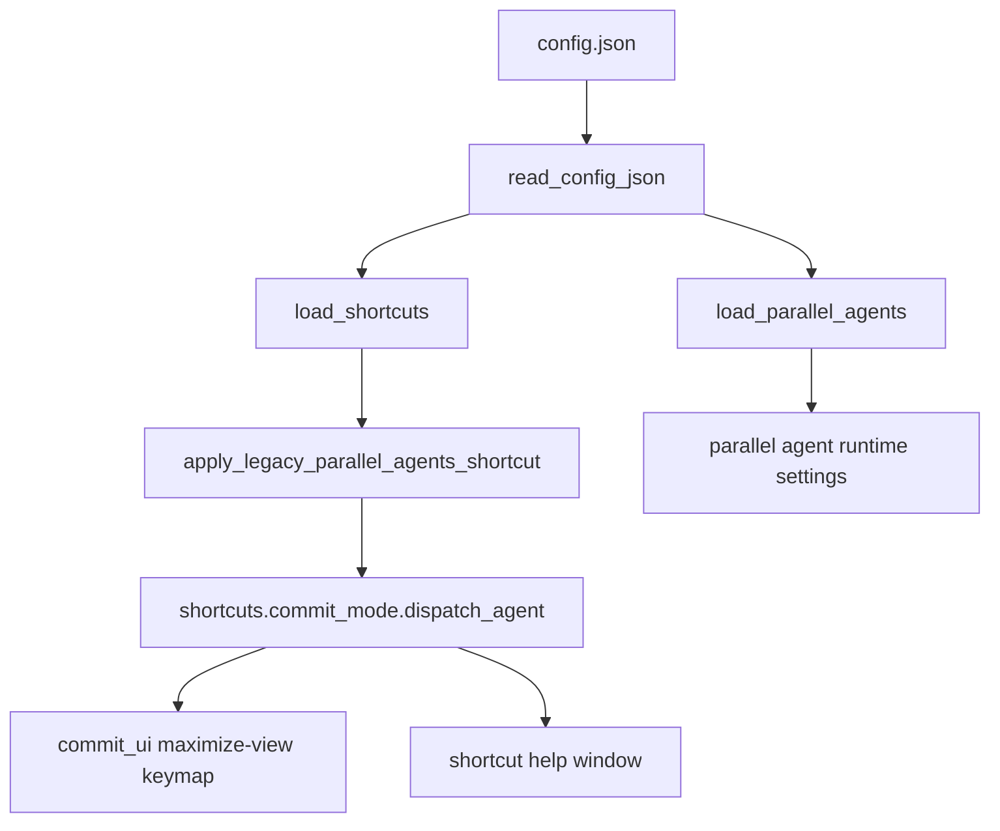

# Architecture Diff

## Summary
Unify the parallel-agent keybinding under the main `shortcuts.commit_mode` config tree, while keeping `parallel_agents.shortcut` as a read-time compatibility fallback.

## Diagram(s)

## Changes

### Added
- Unified `dispatch_agent` shortcut in `shortcuts.commit_mode`
- Compatibility mapping from legacy `parallel_agents.shortcut`
- Shared default-config generation path for `create_default()` and `:Raccoon config`

### Modified
- Maximize-view keymap setup now resolves the agent shortcut from `load_shortcuts()`
- Shortcut help and docs now describe the unified config shape

### Removed
- `parallel_agents.shortcut` as an active runtime config field
