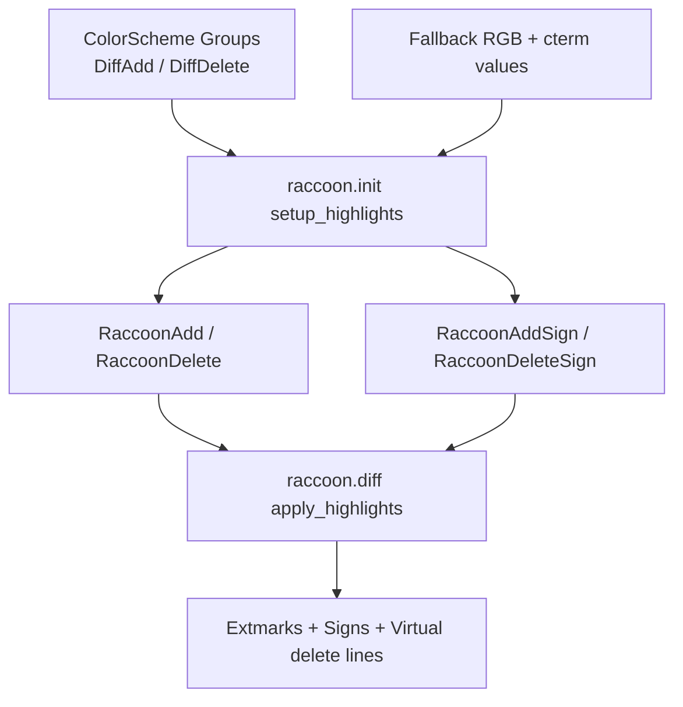

# Architecture Diff

## Summary
Improve cross-platform diff rendering reliability by deriving Raccoon's existing diff highlight groups from Neovim's built-in diff highlights, with terminal fallback colors when the colorscheme does not provide them.

## Diagram(s)

## Changes

### Added
- No new modules.

### Modified
- `lua/raccoon/init.lua`: derive raccoon diff/sign highlight values from `DiffAdd`/`DiffDelete` with fallback RGB + cterm values.
- `tests/init_spec.lua`: add coverage for inherited highlight colors and fallback colors.
- `CHANGELOG.md`: add an unreleased note for applying the Windows diff highlight fix to the current main code path.

### Removed
- Nothing removed.
