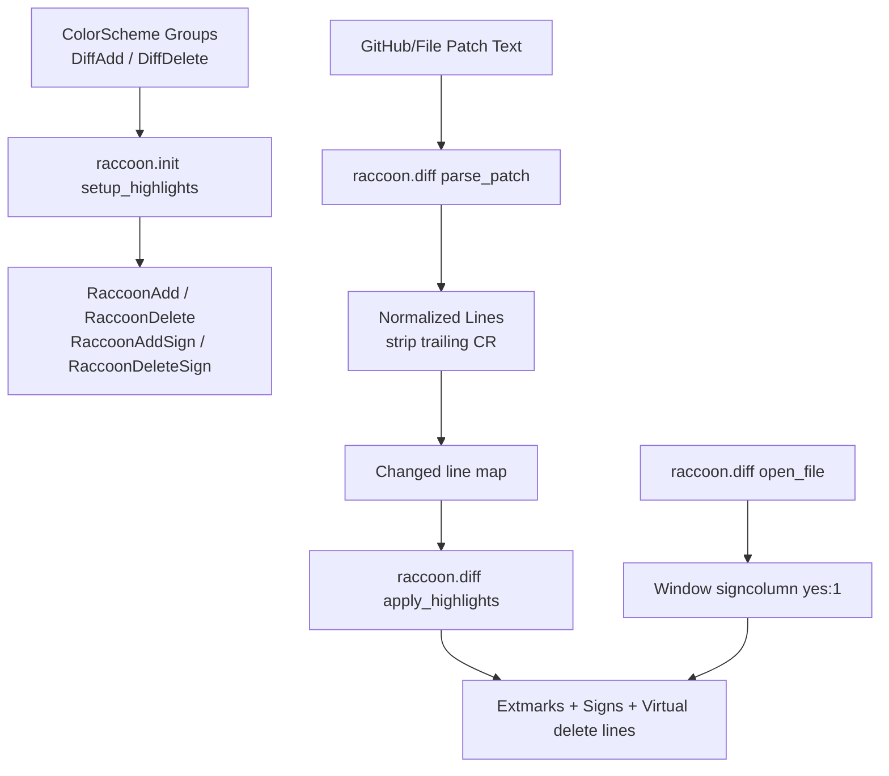

# Architecture Diff

## Summary
Improve cross-platform diff rendering reliability by making highlight resolution theme-aware, enforcing visible diff sign columns in flat diff, and normalizing CRLF patch parsing.

## Diagram(s)

## Changes

### Added
- No new modules.

### Modified
- `lua/raccoon/init.lua`: derive raccoon diff/sign highlight values from `DiffAdd`/`DiffDelete` with fallback RGB + cterm values.
- `lua/raccoon/diff.lua`: normalize CRLF patch lines in parser and enforce `signcolumn=yes:1` when opening review files.
- `tests/init_spec.lua`: add coverage for inherited highlight colors and fallback colors.
- `tests/diff_spec.lua`: add CRLF parsing regression test.
- `CHANGELOG.md`: add unreleased fixes for Windows diff rendering compatibility.

### Removed
- Nothing removed.
