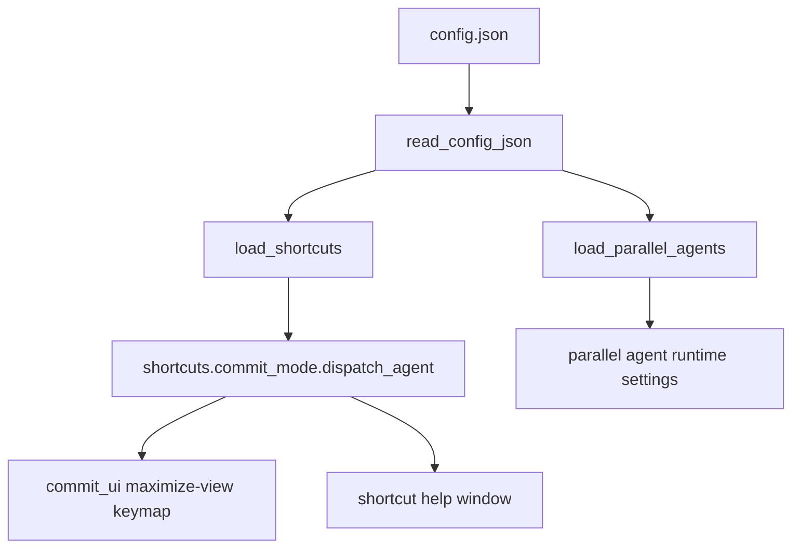

# Architecture Diff

## Summary
Enforce a single config source for parallel-agent dispatch shortcuts: `shortcuts.commit_mode.dispatch_agent`.

## Diagram(s)

## Changes

### Added
- Unified `dispatch_agent` shortcut in `shortcuts.commit_mode`
- Shared default-config generation path for `create_default()` and `:Raccoon config`

### Modified
- Maximize-view keymap setup now resolves the agent shortcut from `load_shortcuts()`
- Shortcut help and docs now describe the unified config shape

### Removed
- Legacy fallback mapping from `parallel_agents.shortcut` to `shortcuts.commit_mode.dispatch_agent`
- `parallel_agents.shortcut` as an active runtime config field
