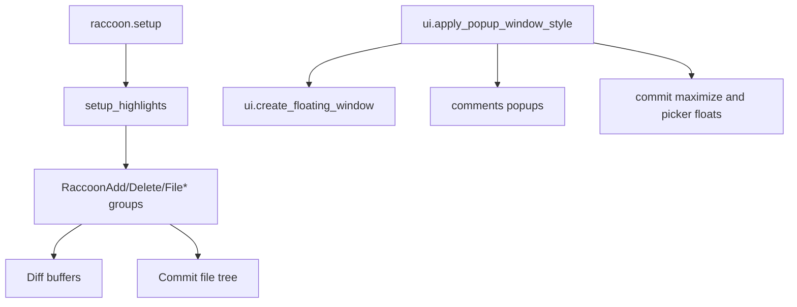
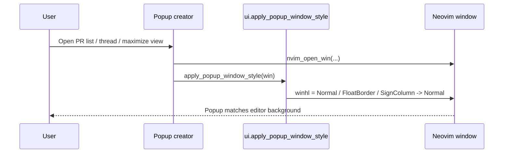

# Architecture Diff

## Summary

Raccoon popup windows now opt into the editor's base highlight groups instead of inheriting theme-specific `NormalFloat` colors, and the plugin's custom diff/file-tree highlights now define terminal fallback colors for environments that do not render RGB-only highlight attrs reliably.

## Diagrams

## Changes

### Added

- `lua/raccoon/ui.lua`: shared popup styling helper for plugin-owned floating windows.
- Terminal fallback attrs in setup tests to guard against regressions in Windows and non-`termguicolors` terminals.

### Modified

- `lua/raccoon/init.lua`: custom diff, sign, and commit file-tree highlights now include `ctermfg`/`ctermbg` fallbacks.
- `lua/raccoon/comments.lua`: readonly thread and editor popups now reuse the shared popup window style.
- `lua/raccoon/commit_ui.lua`: maximize diff, maximize picker, and file-content popup windows now reuse the shared popup window style.
- `tests/init_spec.lua`, `tests/ui_spec.lua`, `tests/comments_spec.lua`, `tests/commit_ui_spec.lua`: cover terminal highlight fallbacks and popup `winhl` behavior.

### Removed

- Reliance on theme-provided `NormalFloat` backgrounds for Raccoon popup windows.
- RGB-only custom highlights as the sole color path for diff and file-tree rendering.
