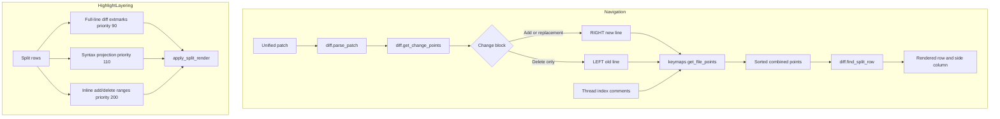

# Architecture Diff

## Summary
Combined diff/comment navigation now uses side-aware diff change points, and split inline range highlights are layered above syntax and full-line diff highlights.

## Diagram(s)

## Changes

### Added
- `diff.get_change_points(patch)`: returns one `{ line, side, type = "diff" }` point per contiguous add/delete block.
- Split range highlight priorities for syntax and inline diff entries.

### Modified
- `keymaps`: uses `diff.get_change_points()` for diff navigation while preserving side-aware comment navigation.
- `diff.apply_split_render()`: applies range highlights with extmarks so priority is explicit.

### Removed
- Mixed old/new changed-line grouping from combined point navigation.
