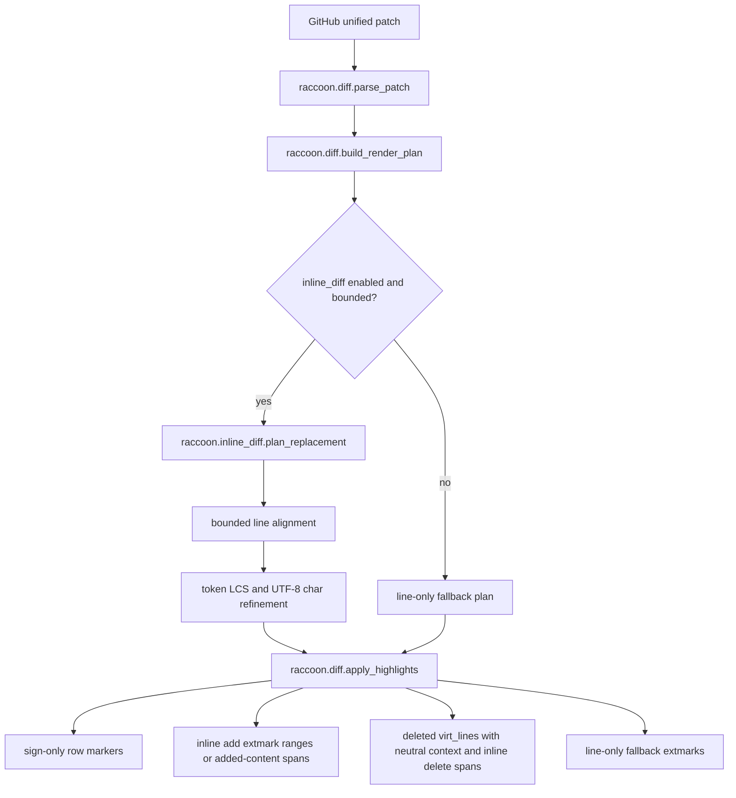

# Architecture Diff

## Summary

Flat diff rendering now plans exact inline add/delete spans from the GitHub patch, aligns similar lines inside multi-line blocks, and applies only character/content highlights in exact mode.

## Diagram(s)

## Changes

### Added

- `lua/raccoon/inline_diff.lua`: bounded token and UTF-8 codepoint diffing for replaced line pairs.
- `raccoon.diff.build_render_plan`: converts parsed patch hunks into added-line ranges and deleted virtual-line chunks.
- `inline_diff` config block: enables exact rendering and defines fallback limits.

### Modified

- `raccoon.diff.apply_highlights`: consumes the render plan, using sign-only markers plus character/content extmarks in exact mode while preserving full-line add and padded deleted-line fallback rendering.
- `raccoon.inline_diff.plan_replacement`: aligns similar old/new lines before computing character spans, so insertions inside multi-line blocks do not force index-based whole-row changes.
- `raccoon.inline_diff.diff_pair`: keeps unchanged old-side virtual-line text neutral in exact mode, reserving delete backgrounds for characters actually removed.
- Highlight setup: adds `RaccoonAddInline` and `RaccoonDeleteInline`.
