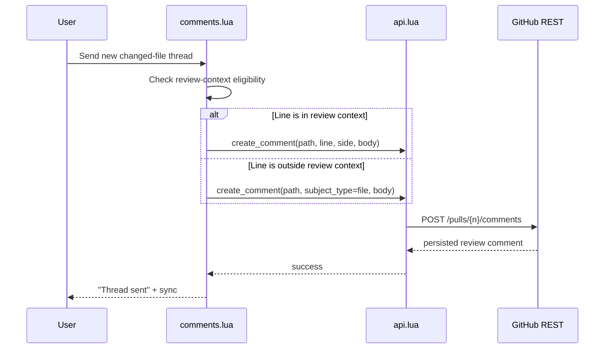

# Architecture Diff

## Summary

Changed-file comment creation now uses persisted REST review comments for every new thread. Lines that GitHub still considers part of the review context use line-level REST comments, and other lines in changed files fall back to file-level REST comments with `subject_type=file`. This removes the transient GraphQL review-creation path that could report success and then disappear after refresh.

## Diagrams

```mermaid
graph TD
    A[comments.lua\nsend_new_thread] --> B{line in review context?}
    B -->|yes| C[api.lua\ncreate_comment\nline + side]
    B -->|no| D[api.lua\ncreate_comment\nsubject_type=file]
    C --> E[GitHub REST\nPOST /pulls/{n}/comments]
    D --> E
    E --> F[comments.lua\nnotify + sync]
```



## Changes

### Added

- `tests/api_spec.lua`: regression coverage for REST file-level review comments.
- `tests/comments_ui_state_spec.lua`: regression coverage for both in-diff and out-of-diff changed-file sends using the persisted REST path.

### Modified

- `lua/raccoon/comments.lua`: new-thread sends now route directly to REST review comments, choosing line-level or file-level payloads based on review-context eligibility.
- `lua/raccoon/api.lua`: `create_comment` remains the single transport for new review comments, including `subject_type=file` support for changed files outside review context.
- `README.md`: comment-flow documentation now matches the REST-only transport.

### Removed

- `lua/raccoon/api.lua:create_review_thread`: unused GraphQL review-thread creation.
- Dependence on transient GraphQL review creation for new changed-file comments.
