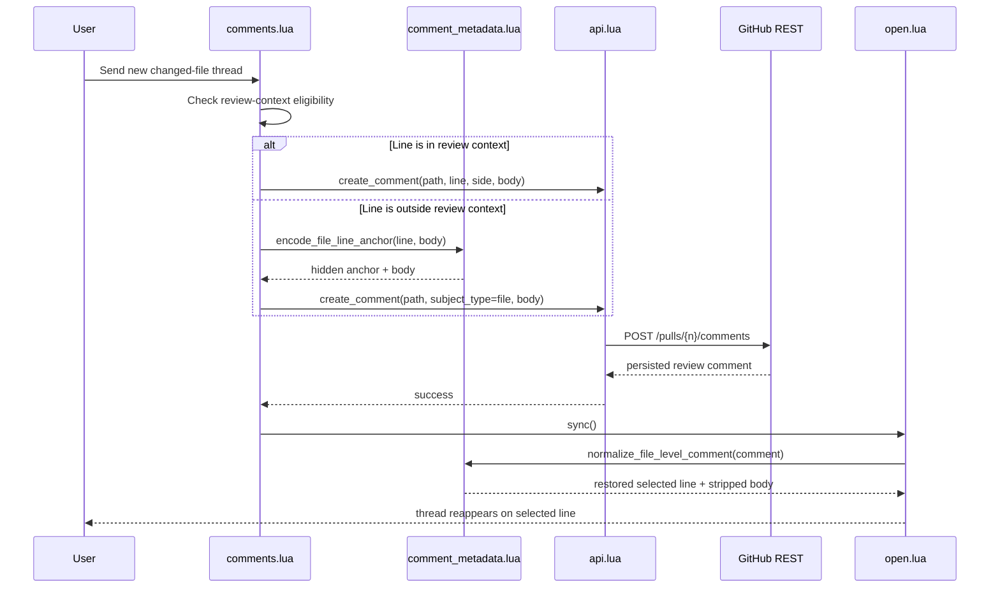

# Architecture Diff

## Summary

Changed-file comment creation still uses persisted REST review comments for every new thread, but file-level fallbacks now carry a hidden line anchor so raccoon can restore them to the user-selected line after sync. This keeps arbitrary changed-file line comments visible in flat diff even when GitHub stores them as `subject_type=file` comments with synthetic or missing line coordinates.

## Diagrams

```mermaid
graph TD
    A[comments.lua\nsend_new_thread] --> B{line in review context?}
    B -->|yes| C[api.lua\ncreate_comment\nline + side]
    B -->|no| D[comment_metadata.lua\nencode hidden line anchor]
    D --> E[api.lua\ncreate_comment\nsubject_type=file]
    C --> F[GitHub REST\nPOST /pulls/{n}/comments]
    E --> F
    F --> G[open.lua\nnormalize file-level anchor]
    G --> H[comments.lua\nnotify + sync]
```



## Changes

### Added

- `tests/api_spec.lua`: regression coverage for REST file-level review comments.
- `tests/comments_ui_state_spec.lua`: regression coverage for both in-diff and out-of-diff changed-file sends using the persisted REST path.
- `lua/raccoon/comment_metadata.lua`: shared helpers for encoding and decoding hidden file-line anchors.
- `tests/file_level_comment_anchor_spec.lua`: regression coverage for file-level fallback anchoring and rehydration.

### Modified

- `lua/raccoon/comments.lua`: file-level fallback sends now prepend a hidden selected-line anchor before posting the REST review comment.
- `lua/raccoon/api.lua`: `create_comment` remains the single transport for new review comments, including `subject_type=file` support for changed files outside review context.
- `lua/raccoon/open.lua`: sync now normalizes file-level review comments so arbitrary-line fallbacks reattach to the original selected line instead of GitHub's synthetic line metadata.
- `README.md`: comment-flow documentation now matches the REST-only transport.

### Removed

- `lua/raccoon/api.lua:create_review_thread`: unused GraphQL review-thread creation.
- Dependence on transient GraphQL review creation for new changed-file comments.
