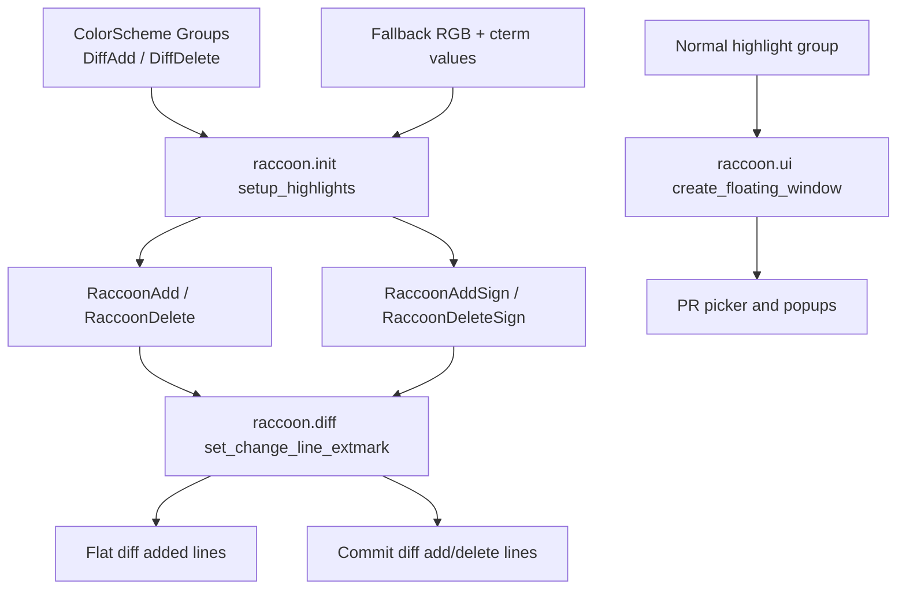

# Architecture Diff

## Summary
Improve PowerShell/terminal rendering by refreshing diff highlight groups from the active colorscheme, applying real changed-row highlight ranges, and making picker floats inherit the editor background.

## Diagram(s)

## Changes

### Added
- No new modules.

### Modified
- `lua/raccoon/init.lua`: refresh raccoon diff/sign highlight values from `DiffAdd`/`DiffDelete` with fallback RGB + cterm values.
- `lua/raccoon/diff.lua`: centralize changed-line extmarks so signs and full-row highlight ranges are applied together.
- `lua/raccoon/commit_ui.lua`: reuse the shared changed-line extmark helper for commit diff rows.
- `lua/raccoon/ui.lua`: make floating windows inherit `Normal` instead of a potentially black `NormalFloat`.
- `tests/init_spec.lua`, `tests/diff_spec.lua`, `tests/commit_ui_spec.lua`, `tests/ui_spec.lua`: add regression coverage for terminal-safe highlights and picker backgrounds.
- `CHANGELOG.md`: add an unreleased note for the PowerShell/terminal highlight fix.

### Removed
- Nothing removed.
