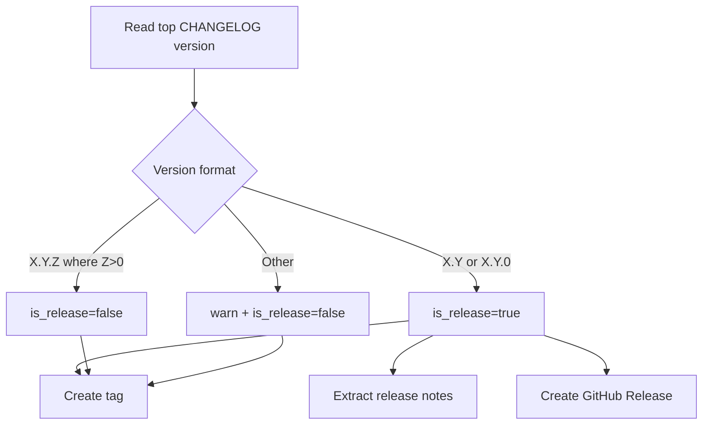

# Architecture Diff

## Summary
Release workflow now classifies `X.Y.0` versions as full releases (create GitHub Release) while keeping `X.Y.Z` with `Z > 0` as patch-only tags.

## Diagram(s)

## Changes
### Modified
- `.github/workflows/release.yml`: broadened release-detection regex and added explicit fallback warning for unknown version formats.

### Added
- `ARCHITECTURE_DIFF.md`: documents release classification behavior for this change set.
