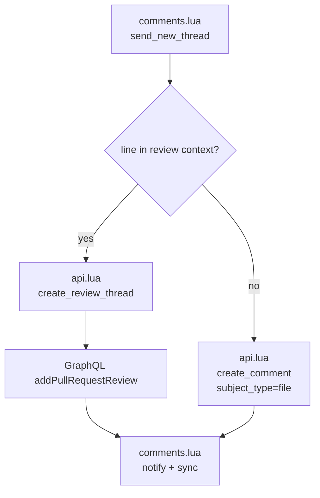
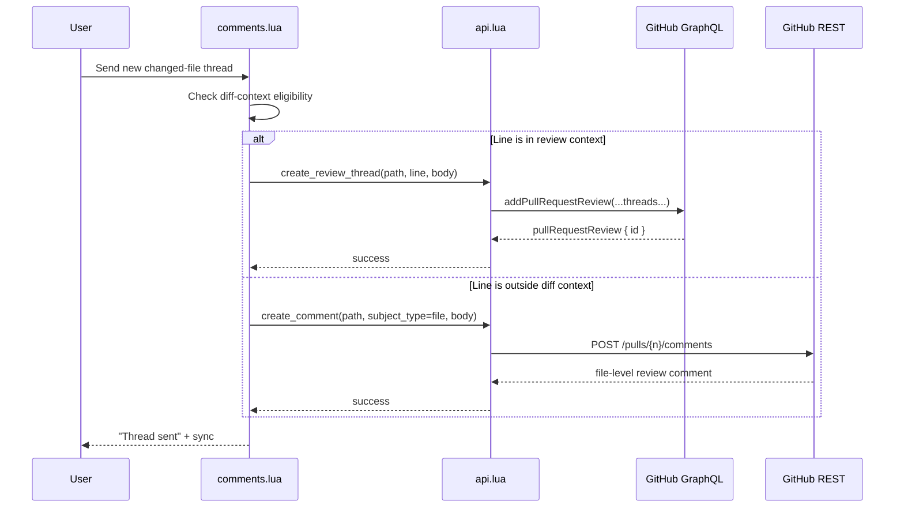

# Architecture Diff

## Summary

Changed-file review comments now split by review target. Real diff lines still use GraphQL thread creation via `addPullRequestReview`, while lines outside GitHub's resolvable diff context fall back to REST file-level review comments using `subject_type=file`.

## Diagrams

## Changes

### Added

- `tests/api_spec.lua`: regression coverage for both the GraphQL changed-line path and the REST file-comment fallback for changed files outside diff context.

### Modified

- `lua/raccoon/api.lua`: `create_review_thread` now selects `pullRequestReview { id }` from `addPullRequestReview`, and `create_comment` now supports REST file-level review comments with `subject_type=file`.
- `lua/raccoon/comments.lua`: changed-file lines outside diff context now bypass GraphQL line resolution and send as file-level REST comments instead.

### Removed

- Dependence on GraphQL line resolution for changed-file comments that are outside GitHub's diff context.
