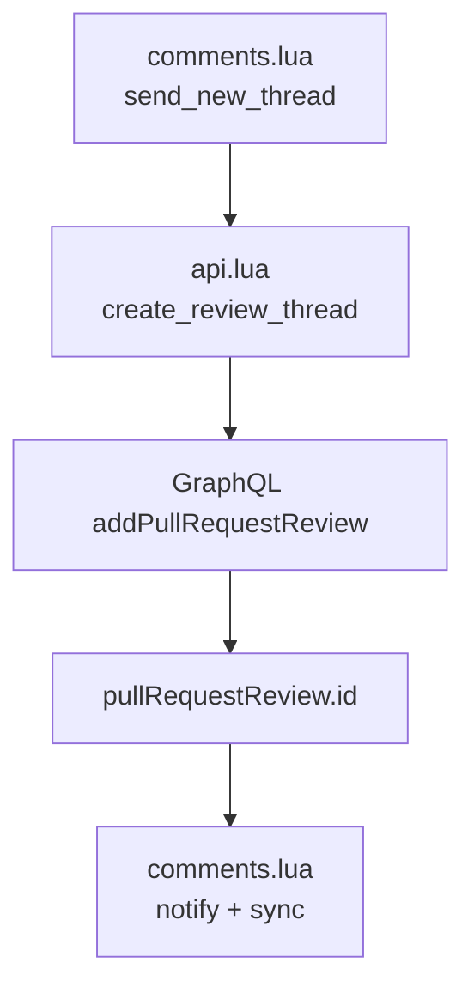
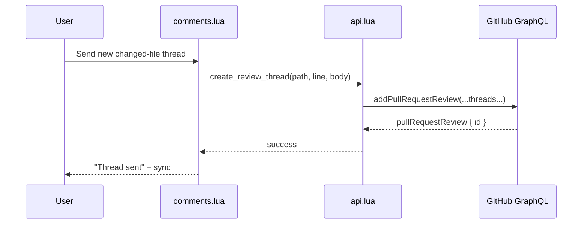

# Architecture Diff

## Summary

Changed-file review threads now use a schema-valid GraphQL payload when creating an immediate review comment above the visible diff hunk. The send path still goes through `addPullRequestReview`, but success is keyed off the created review object instead of a removed top-level payload field.

## Diagrams

## Changes

### Added

- `tests/api_spec.lua`: regression coverage for the changed-file GraphQL thread creation path, including a mocked schema rejection for the old invalid payload selection.
- `tests/helpers/mocks.lua`: `plenary.curl.request` mocking so GraphQL request tests exercise the real API method.

### Modified

- `lua/raccoon/api.lua`: `create_review_thread` now selects `pullRequestReview { id }` from `addPullRequestReview` and treats that as the success signal.

### Removed

- Dependence on `AddPullRequestReviewPayload.comments`, which GitHub no longer exposes on this mutation payload.
