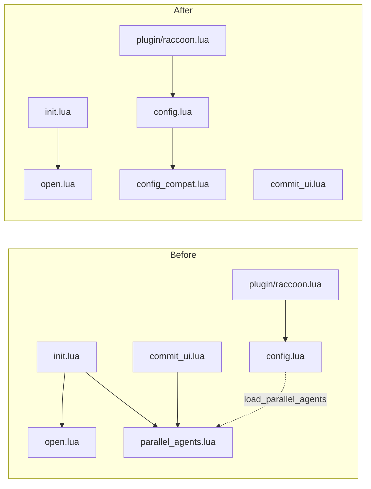
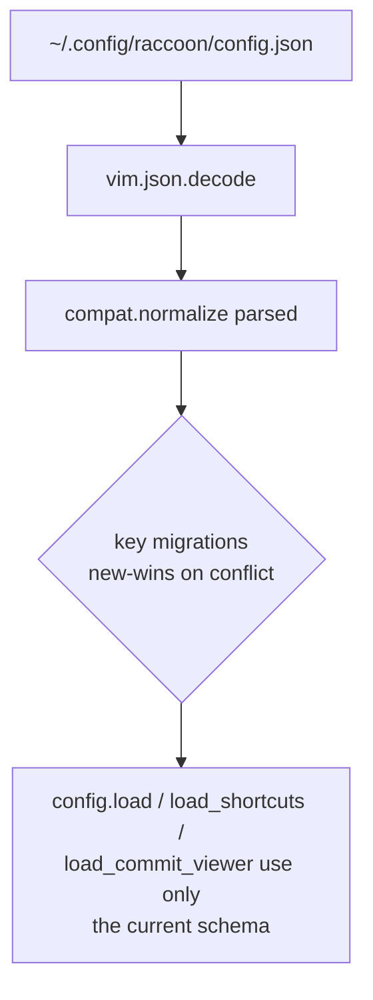

# Architecture Diff

## Summary

Removes the `parallel_agents` feature outright and adds an isolated `config_compat` module so that four breaking config renames (`commit_mode` → `commit_viewer`, `commit_viewer` leaf → `commit_viewer_toggle`, `pull_changes_interval` → `sync_interval`, top-level `passthrough_keymaps` → `commit_viewer.passthrough_keys`) leave existing user configs working.

## Diagrams

### Module graph — before vs after

### Config load flow — backward-compat layer

The migrations applied by `compat.normalize` (called from both `config.load()` and `config.read_config_json()`):

| Old key | New key |
|---------|---------|
| `pull_changes_interval` | `sync_interval` |
| `passthrough_keymaps` (top-level array) | `commit_viewer.passthrough_keys` |
| `shortcuts.commit_viewer` (string leaf) | `shortcuts.commit_viewer_toggle` |
| `shortcuts.commit_mode` (nested table) | `shortcuts.commit_viewer` |

Conflict rule: if both the old and new key are present, the new key wins; the old key is dropped.

## Changes

### Added
- `lua/raccoon/config_compat.lua` — isolated module exporting a single pure function `compat.normalize(parsed)`. Designed to be deletable as one file plus one `require` line in a future major release.
- `tests/config_compat_spec.lua` — 4 unit tests on the migration table (clean / all keys / conflict / non-table input).
- 3 backward-compat integration tests in `tests/config_spec.lua` exercising the migration through `load`, `load_shortcuts`, and `load_commit_viewer`.

### Removed
- `lua/raccoon/parallel_agents.lua` (module)
- `tests/parallel_agents_spec.lua` (27 tests)
- `parallel_agents_docs.md`
- The `parallel_agents` block in `M.defaults` and `M.load_parallel_agents()` loader in `config.lua`
- The agent count in `init.lua`'s statusline and the agent-active condition in `is_active()`
- The `setup_parallel_agent_keymap` helper and its two call sites in `commit_ui.lua`
- The `sanitize_legacy_passthrough_keymaps` helper and unused `bool_field` helper in `config.lua` (replaced by the centralized compat layer)
- The 11 `load_parallel_agents` tests in `tests/config_spec.lua`

### Renamed (with backward-compat at load time)
- Defaults: `pull_changes_interval` → `sync_interval`, `shortcuts.commit_viewer` (string) → `shortcuts.commit_viewer_toggle`, `shortcuts.commit_mode` → `shortcuts.commit_viewer`
- Code references: `commits.lua`, `localcommits.lua`, `commit_ui.lua`, `keymaps.lua`, `open.lua`, `ui.lua` updated to use the new keys
- `plugin/raccoon.lua` default config template updated
- Tests in `config_spec.lua`, `keymaps_spec.lua`, `commits_spec.lua` updated

### Docs
- `README.md`: drop parallel_agents; trim duplicated keymap tables to a 4-row cheatsheet + link to `shortcuts_docs.md`; bump Neovim requirement from 0.9+ to 0.10+; rename keys in examples; mention the 10 s `sync_interval` minimum
- `config_docs.md`: drop parallel_agents subsection; document `commit_viewer.passthrough_keys`; add a "Migrating from older config keys" section
- `shortcuts_docs.md`: drop parallel_agents section; add a Terminology table at the top disambiguating the four contexts where `commit_viewer` appears (top-level config block, toggle leaf, nested in-mode shortcut block, `:Raccoon commits` subcommand); rename keys
- `plugin/raccoon.lua`: update the `:Raccoon` usage hint string to list every subcommand the `complete` callback supports
