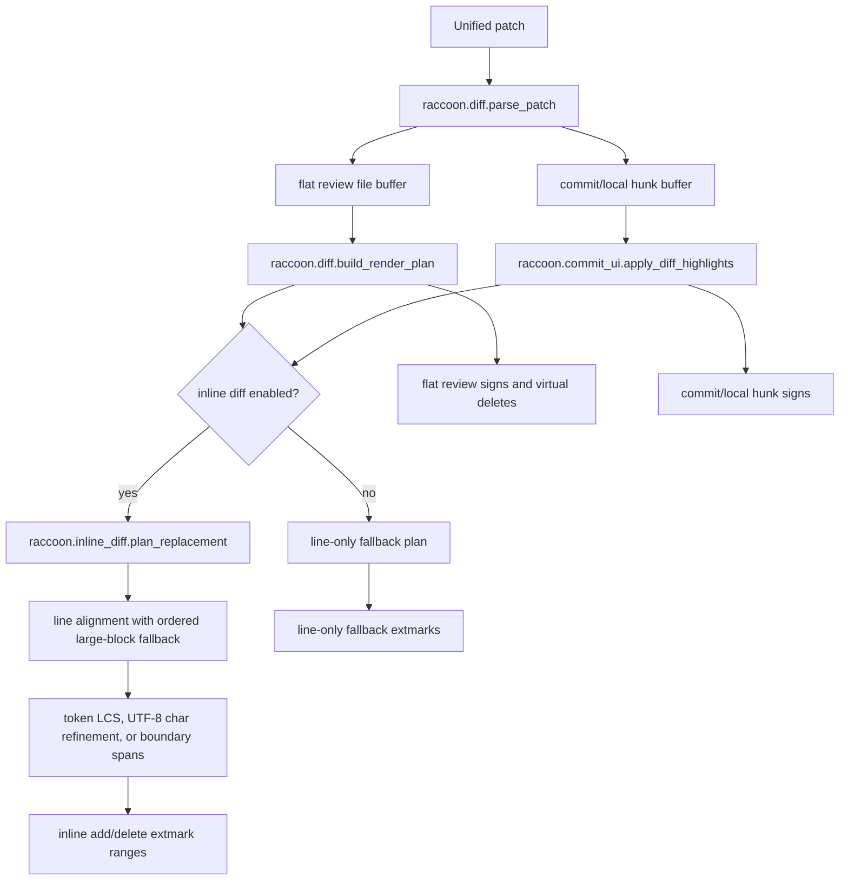

# Architecture Diff

## Summary

Flat and commit/local diff rendering now plan exact inline add/delete spans from patch hunks, align similar lines inside multi-line blocks, and apply only character/content highlights in exact mode.

## Diagram(s)

## Changes

### Added

- `lua/raccoon/inline_diff.lua`: bounded token and UTF-8 codepoint diffing for replaced line pairs, with boundary-span fallback when deeper LCS work is too large.
- `raccoon.diff.build_render_plan`: converts parsed patch hunks into added-line ranges and deleted virtual-line chunks.
- Inline diff rendering uses internal text-based bounds that degrade to simpler span detection instead of whole-line coloring.

### Modified

- `raccoon.diff.apply_highlights`: consumes the render plan, using sign-only markers plus character/content extmarks in exact mode while preserving line-only rendering when inline diffing is explicitly disabled.
- `raccoon.inline_diff.plan_replacement`: aligns similar old/new lines before computing character spans, so insertions inside multi-line blocks do not force index-based whole-row changes.
- `raccoon.commit_ui.apply_diff_highlights`: reuses inline replacement planning for commit/local hunk rows and renders unchanged deleted-row context with `Comment`.
- `raccoon.inline_diff.diff_pair`: renders old-side unchanged context as grey `Comment` chunks, while highlighting only deleted spans in red and added spans in green.
- Highlight setup: keeps whole-line, inline, and sign groups on one green/red intensity per diff side.
