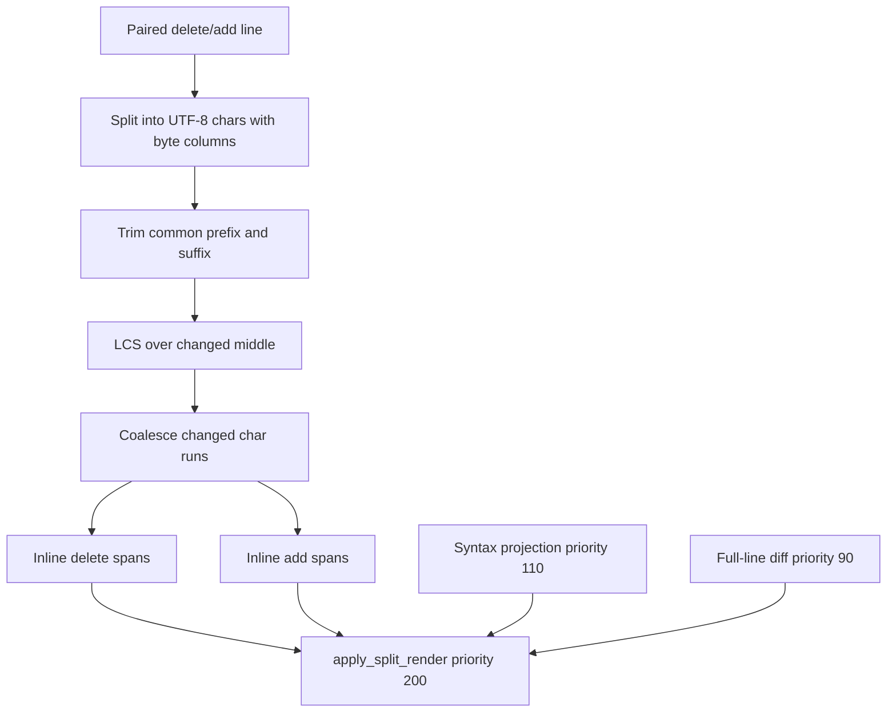
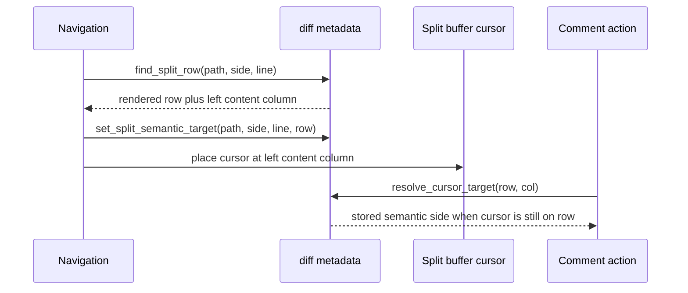
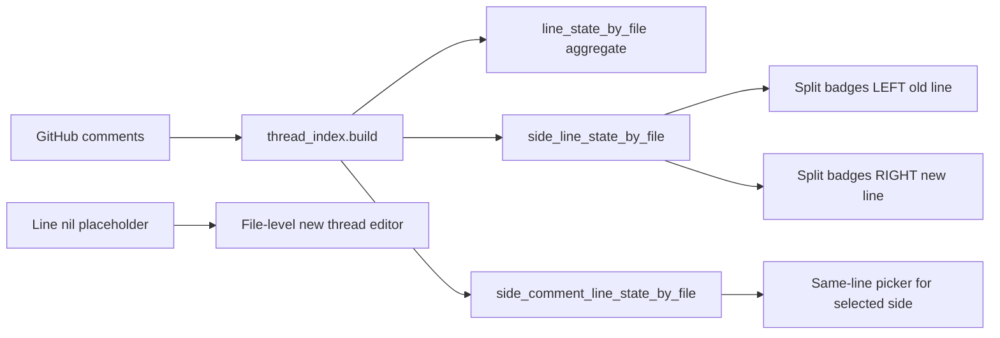

# Architecture Diff

## Summary
Split diff rendering now uses exact character inline decorations, stable left-column cursor placement, and side-aware comment thread buckets.

## Diagram(s)

## Changes

### Added
- `diff.left_cursor_col(rendered)` for split cursor placement.
- `rendered.position_by_key[path|side|line]` for O(1) split row lookup before scan fallback.
- `diff.set_split_semantic_target()` so right-side navigation can display left while preserving right-side comment semantics.
- Side-aware thread index maps for split badges and same-line thread pickers.

### Modified
- Inline changed-line highlighting now computes exact UTF-8 character add/delete runs with byte columns for Neovim extmarks.
- Split navigation, thread jumps, file jumps, diff-only jumps, and resize restore now use the left content column.
- Split comment badge rendering reads LEFT buckets from `old_line` and RIGHT buckets from `new_line`.
- Same-line thread lookup passes the resolved target side.

### Removed
- One-span prefix/suffix inline diff highlighting for paired changed lines.
- Side-insensitive split badge and same-line picker lookup.
