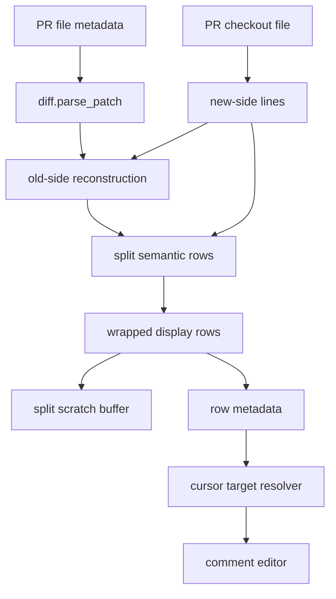
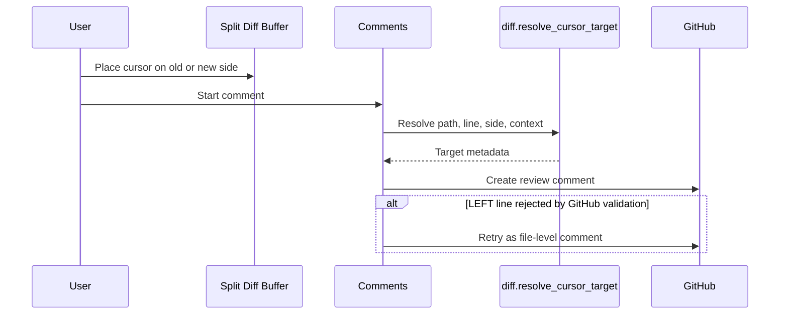

# Architecture Diff

## Summary
Flat PR review now renders a read-only full-file split diff buffer with side-aware row metadata for comments and navigation.

## Diagram(s)

## Changes

### Added
- `lua/raccoon/diff.lua`: split diff model, full-file row alignment, wrapping, metadata attachment, cursor target resolution, inline span helper, and Tree-sitter projection caps.
- `ARCHITECTURE_DIFF.md`: documents the rendering and comment submission flow.

### Modified
- `lua/raccoon/comments.lua`: resolves comment targets from split row metadata, renders side-local badges, submits `LEFT` comments, and falls back to file-level comments on GitHub validation failures.
- `lua/raccoon/commit_ui.lua`: reuses shared inline character spans for stacked commit and local commit diff buffers.
- `lua/raccoon/init.lua`: adds split change and inline highlight groups.

### Removed
- The flat review path no longer opens the PR checkout file directly as the primary review surface.
