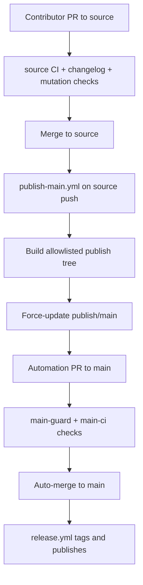

# Architecture Diff
## Summary
Move the repository to a `source` -> `publish/main` -> `main` branch model where human development happens on `source`, GitHub Actions generates a stripped install tree for `main`, and `main` keeps runtime files, the Lua regression subset, user-facing docs, and the minimal workflows needed to validate and release that tree.

## Diagram(s)

## Changes
### Added
- `.github/publish-allowlist.txt`: Single source of truth for the files that remain on the generated `main` branch.
- `.github/workflows/publish-main.yml`: Source-branch workflow that builds the stripped install tree, updates `publish/main`, opens or refreshes the automation PR to `main`, and dispatches `main` validation workflows.
- `.github/workflows/main-guard.yml`: Verifies PRs to `main` come from `publish/main` and exactly match the allowlisted projection of `source`.
- `.github/workflows/main-ci.yml`: Regression-suite validation for the stripped `main` branch.
- `scripts/publish_main.py` plus `tests/publish/test_publish_main.py`: Repo-local publish-tree builder and validation coverage.

### Modified
- `.github/workflows/ci.yml`, `.github/workflows/changelog-check.yml`, and `.github/workflows/mutation.yml`: Retargeted development checks to `source`.
- `Makefile`: Adds `test-python` and includes publish-tool tests in `make test`.
- `README.md`: Documents the `source`/`main` branch model, including the published Lua-only test subset and the publish failure behavior.
- `CHANGELOG.md`: Records the branch-model migration and the stripped `main` surface.

### Removed
- No runtime plugin modules removed from `source`; only source-only developer paths are removed from the generated `main` branch.
