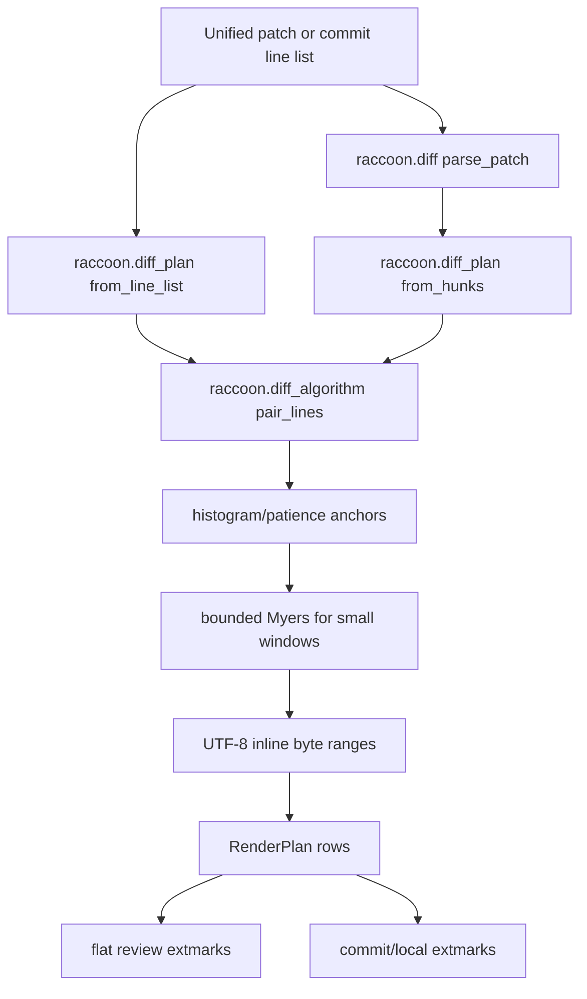

# Exact Inline Diff Reimplementation Plan

> **For agentic workers:** REQUIRED SUB-SKILL: Use `superpowers:subagent-driven-development` or `superpowers:executing-plans` to execute this plan task-by-task. Start from `main`, use the current PR only as behavior evidence, and prefer refactoring or extending existing `main` code over adapting the current PR shape.

**Goal:** Reimplement exact inline diff rendering for flat PR review and commit/local review buffers with a more accurate, maintainable diff engine based on established diff algorithms.

**Architecture:** Keep unified patch parsing and buffer rendering in the existing modules, but move all add/delete pairing and inline span computation into one shared planning layer. The algorithm should use histogram/patience-style anchors for readable line and token alignment, bounded Myers for small ambiguous windows, and deterministic conservative fallbacks when a region is too large or too noisy. Renderers consume a typed render plan; they do not pair lines or compute inline spans themselves.

**Tech Stack:** Lua, Neovim extmarks, Plenary/Busted tests, no new runtime dependencies.

---

## Codex Prompt

You are working in `/home/ubuntu/nvim-raccoon`. The current branch contains PR #126, `[codex] Render exact inline diffs in flat review`, but this plan is for a cleaner replacement implementation. Do not preserve the current PR architecture just because it exists. Use the current PR diff and tests only to inventory desired behavior, then reimplement from `main`.

The implementation should be optimized for accuracy and readability, not for gluing more special cases onto the current `inline_diff.lua`. Use established diff algorithm ideas:

- Git exposes `myers`, `minimal`, `patience`, and `histogram` diff algorithms. Treat this as the relevant algorithm family for code review diffs.
- JGit describes histogram diff as an extension of patience diff that uses low-occurrence common elements as anchors and falls back when chains are too large.
- Myers gives a shortest edit script and is appropriate for small bounded regions after larger regions have been split by stable anchors.

Reference material:

- Git diff algorithm options: https://git-scm.com/docs/diff-options
- JGit `HistogramDiff`: https://archive.eclipse.org/jgit/docs/jgit-2.0.0.201206130900-r/apidocs/org/eclipse/jgit/diff/HistogramDiff.html
- Myers paper: https://publications.mpi-cbg.de/Myers_1986_6330.pdf

## Current PR Analysis

PR #126 currently does these useful things:

- Adds exact inline spans for changed added text in flat review buffers opened through `raccoon.diff.open_file()`.
- Shows deleted-side context as neutral grey while highlighting only removed spans in red.
- Reuses inline behavior in commit/local hunk buffers.
- Removes `inline_diff` from public config and keeps the behavior internal.
- Adds fallbacks for long lines and large replacement blocks.
- Adds focused tests for UTF-8 byte columns, punctuation insertions/removals, shifted replacement lines, and exact extmarks.

The current implementation has avoidable structural problems:

- `lua/raccoon/inline_diff.lua` is a standalone 700+ line module with many local heuristics, but it is not shaped like a clear diff algorithm pipeline.
- `lua/raccoon/diff.lua` and `lua/raccoon/commit_ui.lua` each translate the inline row plan into their own renderer-specific structures, duplicating side-specific logic.
- The patch parser still centers on new-file line numbers and deleted-line anchors, which makes downstream render planning harder than it needs to be.
- The algorithm mixes line pairing, token pairing, character refinement, renderer highlight groups, and fallback policy in one module.
- The tests validate desirable behavior, but several assertions are coupled to the current internal chunk shape instead of a stable render-plan API.

The replacement should keep the behavior, not the implementation shape.

## Target Design

### Data Model

Introduce explicit internal data shapes. Use Lua doc annotations and named constants so invalid states are harder to create.

```lua
---@alias RaccoonPatchLineKind "ctx"|"add"|"del"
---@alias RaccoonDiffSide "old"|"new"
---@alias RaccoonInlineKind "same"|"add"|"del"

---@class RaccoonPatchLine
---@field kind RaccoonPatchLineKind
---@field content string
---@field old_line number|nil
---@field new_line number|nil
---@field anchor_line number

---@class RaccoonInlineChunk
---@field text string
---@field kind RaccoonInlineKind

---@class RaccoonByteRange
---@field start_col number
---@field end_col number

---@class RaccoonRenderRow
---@field old_line RaccoonPatchLine|nil
---@field new_line RaccoonPatchLine|nil
---@field old_chunks RaccoonInlineChunk[]
---@field new_ranges RaccoonByteRange[]
---@field exact boolean

---@class RaccoonRenderPlan
---@field rows RaccoonRenderRow[]
---@field mode "exact"|"line"
```

Rules:

- `old_line` and `new_line` are paired only by the shared planner.
- Renderers never call token or character diff functions directly.
- Highlight group names do not appear in the algorithm module.
- Byte columns are computed only at the edge where Neovim extmarks need them.
- Public config does not expose inline diff tuning.

### Files

- Create `lua/raccoon/diff_algorithm.lua`: generic sequence diff helpers. Owns histogram anchors, bounded Myers, tokenization, UTF-8 character splitting, and edit script normalization.
- Create `lua/raccoon/diff_plan.lua`: converts parsed hunks or commit/local `line_list` entries into `RaccoonRenderPlan`.
- Modify `lua/raccoon/diff.lua`: keep patch parsing, navigation, and flat-buffer rendering; delegate render planning to `diff_plan`.
- Modify `lua/raccoon/commit_ui.lua`: keep grid and hunk rendering; delegate render planning to `diff_plan`.
- Modify `lua/raccoon/init.lua`: define shared add/delete inline highlight groups using existing colors.
- Modify `lua/raccoon/config.lua`: drop legacy `inline_diff` during config load if present, without documenting it as supported.
- Add tests in `tests/diff_algorithm_spec.lua`, `tests/diff_plan_spec.lua`, and focused additions to `tests/diff_spec.lua`, `tests/commit_ui_spec.lua`, `tests/config_spec.lua`, and `tests/init_spec.lua`.
- Replace `ARCHITECTURE_DIFF.md` before opening a PR.
- Update `README.md` and `CHANGELOG.md` only after behavior is implemented and verified.

## Algorithm Requirements

### Layer 1: Replacement Block Alignment

For each contiguous block of deleted and added patch lines:

1. Strip common prefix and suffix rows by exact normalized content.
2. Run histogram alignment on the middle rows.
3. Use low-occurrence exact line content as anchors.
4. If no line anchors exist, rank candidate pairs by a bounded token similarity score.
5. Run bounded Myers only inside small unanchored windows.
6. If a window exceeds the bound, pair only high-confidence rows and leave the rest as pure additions/deletions.

Do not index-pair a large block just because counts are similar. Index-pairing is allowed only for a small window where token similarity is above the configured internal threshold.

### Layer 2: Token Alignment Within Paired Lines

Tokenize each line into:

- `word`: `%w` and `_` runs
- `space`: whitespace runs
- `punct`: every punctuation codepoint as its own token unless repeated punctuation is identical on both sides

Then:

1. Trim common prefix and suffix tokens.
2. Use histogram anchors over non-space tokens.
3. Ignore high-frequency anchors such as repeated braces, commas, or blank tokens when they exceed `MAX_CHAIN_LENGTH`.
4. Use bounded Myers for each remaining small token window.
5. Keep identical punctuation and whitespace neutral; do not hide punctuation changes.

### Layer 3: Character Refinement

Within changed token windows:

1. Split by UTF-8 codepoint.
2. Trim common prefix and suffix characters.
3. Run bounded Myers only if `old_chars * new_chars <= MAX_INLINE_CHAR_CELLS`.
4. If Myers is skipped, highlight the prefix/suffix middle span.
5. Convert new-side character spans to byte columns only after final spans are selected.

### Bounds

Use named constants in `diff_algorithm.lua`:

```lua
local MAX_CHAIN_LENGTH = 64
local MAX_MYERS_CELLS = 20000
local MAX_INLINE_CHAR_CELLS = 12000
local MIN_LINE_SIMILARITY = 0.55
local MIN_TOKEN_SIMILARITY = 0.45
```

These are internal constants, not user config.

## Implementation Tasks

### Task 1: Reset The Shape From Main And Capture Behavior

**Files:**

- Read: `lua/raccoon/diff.lua`
- Read: `lua/raccoon/commit_ui.lua`
- Read: current PR diff for `lua/raccoon/inline_diff.lua`, `tests/inline_diff_spec.lua`, `tests/diff_spec.lua`, and `tests/commit_ui_spec.lua`
- Create: `docs/inline-diff-behavior-notes.md`

- [ ] **Step 1: Start from main**

Run:

```bash
git fetch origin main
git checkout main
git pull --ff-only origin main
git checkout -b codex/reimplement-inline-diff-algorithm
```

Expected: branch is based on `origin/main`.

- [ ] **Step 2: Inventory behavior from PR #126**

Run:

```bash
git diff origin/main...origin/inline-diff-rendering -- lua tests > /tmp/inline-diff-pr126.patch
```

Write `docs/inline-diff-behavior-notes.md` with these exact sections:

```markdown
# Inline Diff Behavior Notes

## Required User Behavior

- Flat review buffers show signs for added/deleted rows.
- Flat review buffers highlight only changed added spans when a replacement pair is known.
- Deleted virtual lines show unchanged deleted-side context as neutral text and removed spans as delete inline text.
- Commit/local hunk buffers use the same inline span decisions as flat review.
- Pure additions highlight the whole added content in exact mode.
- Pure deletions highlight the whole deleted content in exact mode.
- Legacy line-only rendering remains available internally for fallback tests.
- Public config does not expose inline diff options.

## Known Current-PR Design Problems

- Current pairing and rendering are spread across `inline_diff.lua`, `diff.lua`, and `commit_ui.lua`.
- Current parser does not expose old and new line numbers as first-class fields.
- Current algorithm is LCS-heavy and heuristic-heavy instead of a clear histogram/Myers pipeline.

## Replacement Acceptance Criteria

- One planner produces render rows for both flat review and commit/local buffers.
- Renderers contain extmark code only.
- Algorithm code does not know Neovim highlight group names.
- Large or ambiguous regions degrade conservatively rather than inventing low-confidence inline spans.
```

- [ ] **Step 3: Commit notes**

Run:

```bash
git add docs/inline-diff-behavior-notes.md
git commit -m "docs: capture inline diff replacement behavior"
```

### Task 2: Extend Patch Lines With Old/New Coordinates

**Files:**

- Modify: `lua/raccoon/diff.lua`
- Test: `tests/diff_spec.lua`

- [ ] **Step 1: Add parser tests first**

Add tests that assert parsed lines carry old and new coordinates:

```lua
it("tracks old and new coordinates for replacement lines", function()
  local patch = table.concat({
    "@@ -10,3 +20,3 @@",
    " context",
    "-old value",
    "+new value",
    " tail",
  }, "\n")

  local hunks = diff.parse_patch(patch)
  assert.equals("ctx", hunks[1].lines[1].kind)
  assert.equals(10, hunks[1].lines[1].old_line)
  assert.equals(20, hunks[1].lines[1].new_line)
  assert.equals("del", hunks[1].lines[2].kind)
  assert.equals(11, hunks[1].lines[2].old_line)
  assert.is_nil(hunks[1].lines[2].new_line)
  assert.equals(20, hunks[1].lines[2].anchor_line)
  assert.equals("add", hunks[1].lines[3].kind)
  assert.is_nil(hunks[1].lines[3].old_line)
  assert.equals(21, hunks[1].lines[3].new_line)
  assert.equals(21, hunks[1].lines[3].anchor_line)
end)
```

- [ ] **Step 2: Preserve backwards compatibility**

When updating `parse_patch`, keep existing `type` and `line_num` fields populated:

```lua
line.kind = line.kind or line.type
line.type = line.type or line.kind
line.line_num = line.new_line or line.anchor_line
```

Existing callers in `comments.lua`, `keymaps.lua`, and `commits.lua` should continue to work.

- [ ] **Step 3: Run parser tests**

Run:

```bash
nvim --headless -u tests/minimal_init.lua -c "PlenaryBustedFile tests/diff_spec.lua" -c qa
```

Expected: all `diff_spec.lua` tests pass.

- [ ] **Step 4: Commit parser change**

Run:

```bash
git add lua/raccoon/diff.lua tests/diff_spec.lua
git commit -m "refactor: track both sides in parsed patch lines"
```

### Task 3: Implement Generic Diff Algorithms

**Files:**

- Create: `lua/raccoon/diff_algorithm.lua`
- Test: `tests/diff_algorithm_spec.lua`

- [ ] **Step 1: Write algorithm tests**

Create tests covering:

```lua
local algo = require("raccoon.diff_algorithm")

describe("raccoon.diff_algorithm", function()
  it("uses low-occurrence anchors instead of repeated punctuation", function()
    local old = { "}", "local a = 1", "}", "return a" }
    local new = { "}", "local b = 1", "}", "return b" }
    local edits = algo.diff_sequence(old, new, { mode = "line" })
    assert.truthy(vim.tbl_count(edits) > 0)
    assert.equals("equal", edits[#edits - 1].kind)
  end)

  it("finds shifted similar lines without index pairing", function()
    local old = { "return call(foo bar)", "local line_idx = line_num - 1" }
    local new = { "local ranges = add.ranges or {}", "return call(foo, bar)", "local line_idx = add.line_num - 1" }
    local pairs = algo.pair_lines(old, new)
    assert.is_nil(pairs[1].old_index)
    assert.equals(1, pairs[2].old_index)
    assert.equals(2, pairs[2].new_index)
    assert.equals(2, pairs[3].old_index)
    assert.equals(3, pairs[3].new_index)
  end)

  it("returns UTF-8 byte ranges for changed characters", function()
    local result = algo.diff_inline('local icon = "✓"', 'local icon = "✗"')
    assert.same({ { start_col = vim.str_byteindex('local icon = "✗"', 14), end_col = vim.str_byteindex('local icon = "✗"', 15) } }, result.new_ranges)
  end)
end)
```

- [ ] **Step 2: Implement public functions**

`diff_algorithm.lua` should expose only these functions:

```lua
M.diff_sequence(old_items, new_items, opts) -- returns normalized equal/add/del edits
M.pair_lines(old_lines, new_lines) -- returns ordered {old_index?, new_index?} rows
M.diff_inline(old_line, new_line) -- returns {old_chunks, new_ranges, exact}
```

- [ ] **Step 3: Implement histogram anchors**

The histogram splitter should:

- build occurrence counts for old sequence items,
- scan new sequence items for matching old items with occurrence count `<= MAX_CHAIN_LENGTH`,
- choose an increasing match run that minimizes occurrence count and maximizes run length,
- recursively diff before and after the chosen anchor run,
- call bounded Myers when no anchor is available and the region is small enough,
- return replace edits when the region is too large.

- [ ] **Step 4: Implement bounded Myers**

Keep Myers local to `diff_algorithm.lua`. It should return edit operations, not highlight groups. Enforce `MAX_MYERS_CELLS` before allocating tables.

- [ ] **Step 5: Run algorithm tests**

Run:

```bash
nvim --headless -u tests/minimal_init.lua -c "PlenaryBustedFile tests/diff_algorithm_spec.lua" -c qa
```

Expected: all algorithm tests pass.

- [ ] **Step 6: Commit algorithm**

Run:

```bash
git add lua/raccoon/diff_algorithm.lua tests/diff_algorithm_spec.lua
git commit -m "feat: add bounded histogram inline diff algorithm"
```

### Task 4: Add A Shared Render Planner

**Files:**

- Create: `lua/raccoon/diff_plan.lua`
- Test: `tests/diff_plan_spec.lua`

- [ ] **Step 1: Write planner tests**

Create tests for:

```lua
local diff = require("raccoon.diff")
local plan = require("raccoon.diff_plan")

it("builds exact replacement rows from patch hunks", function()
  local hunks = diff.parse_patch(table.concat({
    "@@ -1,2 +1,2 @@",
    "-local total_count = item.count",
    "+local total_size = item.count",
  }, "\n"))

  local render = plan.from_hunks(hunks)
  assert.equals("exact", render.mode)
  assert.equals(1, #render.rows)
  assert.equals("local total_count = item.count", render.rows[1].old_line.content)
  assert.equals("local total_size = item.count", render.rows[1].new_line.content)
  assert.is_true(render.rows[1].exact)
  assert.is_true(#render.rows[1].new_ranges > 0)
end)

it("uses the same planner shape for commit line lists", function()
  local render = plan.from_line_list({
    { type = "del", content = "return call(foo bar)" },
    { type = "add", content = "return call(foo, bar)" },
  })
  assert.equals("exact", render.mode)
  assert.equals(1, #render.rows)
  assert.is_true(render.rows[1].exact)
end)
```

- [ ] **Step 2: Implement planner constructors**

Expose:

```lua
M.from_hunks(hunks, opts)
M.from_line_list(line_list, opts)
```

Both functions return the same `RaccoonRenderPlan` shape.

- [ ] **Step 3: Keep fallback mode internal**

Support `opts = { mode = "line" }` only for tests and explicit internal fallback. Do not read this from user config.

- [ ] **Step 4: Run planner tests**

Run:

```bash
nvim --headless -u tests/minimal_init.lua -c "PlenaryBustedFile tests/diff_plan_spec.lua" -c qa
```

Expected: all planner tests pass.

- [ ] **Step 5: Commit planner**

Run:

```bash
git add lua/raccoon/diff_plan.lua tests/diff_plan_spec.lua
git commit -m "feat: add shared inline diff render planner"
```

### Task 5: Wire Flat Review Rendering To The Planner

**Files:**

- Modify: `lua/raccoon/diff.lua`
- Test: `tests/diff_spec.lua`

- [ ] **Step 1: Replace `get_changed_lines` usage inside `apply_highlights`**

Keep `get_changed_lines` for existing callers, but make `apply_highlights` use:

```lua
local diff_plan = require("raccoon.diff_plan")
local render = diff_plan.from_hunks(M.parse_patch(patch), opts)
```

- [ ] **Step 2: Add flat-renderer extmark tests**

Assert:

- added lines receive `RaccoonAddSign`,
- exact mode does not set `line_hl_group = "RaccoonAdd"` for replacement rows,
- added changed spans receive `RaccoonAddInline`,
- deleted virtual lines contain neutral chunks and `RaccoonDeleteInline` chunks,
- line mode preserves whole-line backgrounds.

- [ ] **Step 3: Keep renderer responsibilities narrow**

`diff.lua` may map planner chunk kinds to highlight groups:

```lua
local OLD_CHUNK_HL = {
  same = "Comment",
  del = "RaccoonDeleteInline",
}
```

It must not call `diff_algorithm.diff_inline` directly.

- [ ] **Step 4: Run flat diff tests**

Run:

```bash
nvim --headless -u tests/minimal_init.lua -c "PlenaryBustedFile tests/diff_spec.lua" -c qa
```

Expected: all `diff_spec.lua` tests pass.

- [ ] **Step 5: Commit flat renderer integration**

Run:

```bash
git add lua/raccoon/diff.lua tests/diff_spec.lua
git commit -m "feat: render flat inline diffs from shared plan"
```

### Task 6: Wire Commit And Local Review Rendering To The Planner

**Files:**

- Modify: `lua/raccoon/commit_ui.lua`
- Test: `tests/commit_ui_spec.lua`

- [ ] **Step 1: Replace local pairing logic**

`commit_ui.apply_diff_highlights` should call:

```lua
local diff_plan = require("raccoon.diff_plan")
local render = diff_plan.from_line_list(line_list, opts)
```

It should then apply signs and inline extmarks from `render.rows`.

- [ ] **Step 2: Add commit renderer tests**

Assert the same examples from flat review:

- shifted blocks align correctly,
- dotted identifier replacement highlights the object name rather than a tiny shared prefix/suffix,
- deleted context is neutral while deleted span is red,
- no whole-line backgrounds in exact replacement mode.

- [ ] **Step 3: Keep commit renderer free of algorithm code**

After implementation, this command should return no matches:

```bash
rg "diff_inline|pair_lines|diff_sequence|MAX_CHAIN|MYERS" lua/raccoon/commit_ui.lua
```

- [ ] **Step 4: Run commit UI tests**

Run:

```bash
nvim --headless -u tests/minimal_init.lua -c "PlenaryBustedFile tests/commit_ui_spec.lua" -c qa
```

Expected: all `commit_ui_spec.lua` tests pass.

- [ ] **Step 5: Commit commit/local integration**

Run:

```bash
git add lua/raccoon/commit_ui.lua tests/commit_ui_spec.lua
git commit -m "feat: render commit inline diffs from shared plan"
```

### Task 7: Remove Public Config Surface And Finish Highlights

**Files:**

- Modify: `lua/raccoon/config.lua`
- Modify: `lua/raccoon/init.lua`
- Modify: `README.md`
- Modify: `CHANGELOG.md`
- Test: `tests/config_spec.lua`
- Test: `tests/init_spec.lua`

- [ ] **Step 1: Config behavior**

Add or keep tests that assert:

```lua
assert.is_nil(config.defaults.inline_diff)
assert.is_nil(config.load_inline_diff)
```

Also assert loaded legacy JSON drops `inline_diff`:

```lua
assert.is_nil(cfg.inline_diff)
```

- [ ] **Step 2: Highlight behavior**

Define:

- `RaccoonAdd`
- `RaccoonDelete`
- `RaccoonAddInline`
- `RaccoonDeleteInline`
- `RaccoonAddSign`
- `RaccoonDeleteSign`

Use one green intensity and one red intensity across line, inline, and sign groups.

- [ ] **Step 3: Documentation updates**

Update README feature text to mention exact inline diff highlighting. Add a CHANGELOG entry after implementation is verified.

- [ ] **Step 4: Run config and init tests**

Run:

```bash
nvim --headless -u tests/minimal_init.lua -c "PlenaryBustedFile tests/config_spec.lua" -c qa
nvim --headless -u tests/minimal_init.lua -c "PlenaryBustedFile tests/init_spec.lua" -c qa
```

Expected: both files pass.

- [ ] **Step 5: Commit config and docs**

Run:

```bash
git add lua/raccoon/config.lua lua/raccoon/init.lua README.md CHANGELOG.md tests/config_spec.lua tests/init_spec.lua
git commit -m "feat: keep inline diff rendering internal"
```

### Task 8: Verify Whole Feature And Prepare PR

**Files:**

- Replace: `ARCHITECTURE_DIFF.md`
- Review: all changed files

- [ ] **Step 1: Replace architecture diff**

Write `ARCHITECTURE_DIFF.md` with at least this Mermaid diagram:

````markdown
# Architecture Diff

## Summary

Exact inline diff rendering is now planned by one shared render planner using histogram anchors and bounded Myers refinement, then consumed by flat review and commit/local renderers.

## Diagram(s)



## Changes

### Added

- `lua/raccoon/diff_algorithm.lua`: bounded histogram/Myers sequence and inline diffing.
- `lua/raccoon/diff_plan.lua`: shared render-plan construction for flat review and commit/local buffers.

### Modified

- `lua/raccoon/diff.lua`: parses both old and new line coordinates and renders flat review from `RaccoonRenderPlan`.
- `lua/raccoon/commit_ui.lua`: renders commit/local hunks from `RaccoonRenderPlan`.
- `lua/raccoon/init.lua`: defines consistent line, inline, and sign highlight groups.
- `lua/raccoon/config.lua`: strips legacy `inline_diff` config without exposing it.
````

- [ ] **Step 2: Run focused tests**

Run:

```bash
nvim --headless -u tests/minimal_init.lua -c "PlenaryBustedFile tests/diff_algorithm_spec.lua" -c qa
nvim --headless -u tests/minimal_init.lua -c "PlenaryBustedFile tests/diff_plan_spec.lua" -c qa
nvim --headless -u tests/minimal_init.lua -c "PlenaryBustedFile tests/diff_spec.lua" -c qa
nvim --headless -u tests/minimal_init.lua -c "PlenaryBustedFile tests/commit_ui_spec.lua" -c qa
nvim --headless -u tests/minimal_init.lua -c "PlenaryBustedFile tests/config_spec.lua" -c qa
nvim --headless -u tests/minimal_init.lua -c "PlenaryBustedFile tests/init_spec.lua" -c qa
```

Expected: every command exits 0.

- [ ] **Step 3: Run full verification**

Run:

```bash
make test
make lint
git diff --check
```

Expected: all commands exit 0.

- [ ] **Step 4: Commit architecture doc**

Run:

```bash
git add ARCHITECTURE_DIFF.md
git commit -m "docs: document inline diff architecture"
```

- [ ] **Step 5: Review final diff size**

Run:

```bash
git diff --stat origin/main...HEAD
git diff --name-status origin/main...HEAD
```

Expected: the PR is smaller and more cohesive than PR #126, with algorithm and planner code separated from renderer code.

- [ ] **Step 6: Push and open PR**

Run:

```bash
git push -u origin codex/reimplement-inline-diff-algorithm
gh pr create --draft --base main --head codex/reimplement-inline-diff-algorithm --title "[codex] Reimplement exact inline diffs with shared planner" --body-file /tmp/inline-diff-pr-body.md
```

The PR body should state:

- behavior preserved from PR #126,
- implementation changed to shared render planning plus bounded histogram/Myers algorithms,
- no public inline diff config,
- validation commands and results.

## Non-Negotiable Constraints

- Do not add external dependencies.
- Do not expose algorithm tuning in public config.
- Do not duplicate line-pairing or inline-span logic in `diff.lua` and `commit_ui.lua`.
- Do not highlight whole replacement lines in exact mode when a confident inline span exists.
- Do not fabricate inline spans for large ambiguous regions.
- Do not let algorithm code know Neovim highlight group names.
- Do not remove existing public functions unless all call sites and tests are updated in the same task.
- Do not touch unrelated UI, comments, GitHub API, auth, or file-tree behavior.

## Final Acceptance Checklist

- [ ] `lua/raccoon/diff_algorithm.lua` owns sequence and inline algorithms.
- [ ] `lua/raccoon/diff_plan.lua` owns render row construction.
- [ ] `lua/raccoon/diff.lua` renders flat review from `RaccoonRenderPlan`.
- [ ] `lua/raccoon/commit_ui.lua` renders commit/local hunks from `RaccoonRenderPlan`.
- [ ] Patch lines include old and new coordinates while preserving existing `type` and `line_num` compatibility.
- [ ] UTF-8 inline ranges are byte columns.
- [ ] Shifted replacement blocks align by content, not by index.
- [ ] Repeated low-information tokens do not dominate matching.
- [ ] Large ambiguous regions degrade conservatively.
- [ ] Public config does not include `inline_diff`.
- [ ] `make test`, `make lint`, and `git diff --check` pass.
